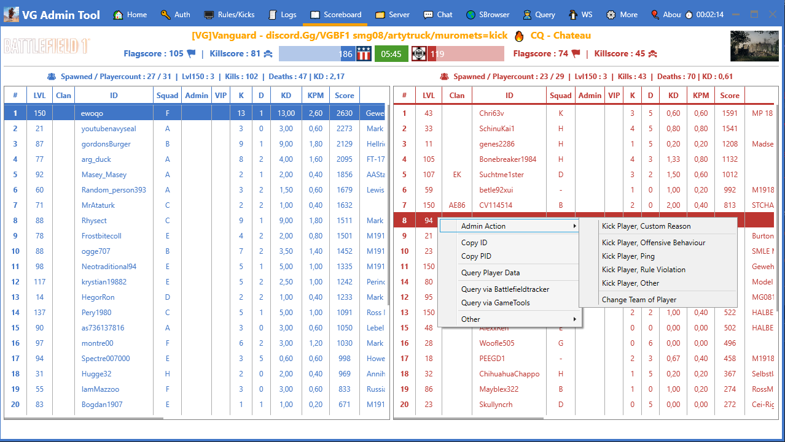
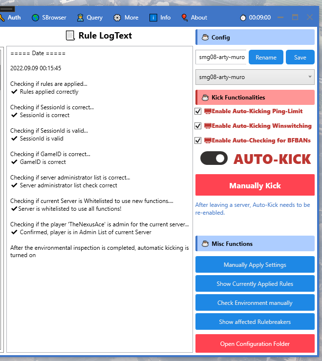

### Warning: Old Spaghetti Code from 2022. Written in C#, .NET 6 through Visual Studio.

## BF1.ServerAdminTools (2022):

Windows Desktop Interface to administrate Battlefield 1 Servers.
Made using WPF.

## AdminToolVG (2023):

Lightweight and performant Command Line Interface to administrate Battlefield 1 Servers.

